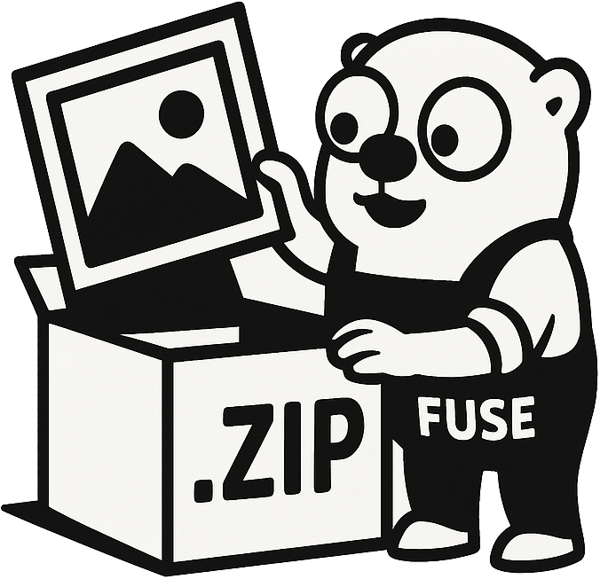

<div align="left">
    
    <br><br>
    
    <a href="https://github.com/desertwitch/zipfuse/tags" target="_blank"></a>
    <a href="https://go.dev/"></a>
    <a href="https://pkg.go.dev/github.com/desertwitch/zipfuse" target="_blank"></a>
    <a href="https://goreportcard.com/report/github.com/desertwitch/zipfuse" target="_blank"></a>
    <a href="./LICENSE" target="_blank"></a>
    <br>
    <a href="https://codecov.io/gh/desertwitch/zipfuse" target="_blank"></a>
    <a href="https://github.com/desertwitch/zipfuse/actions/workflows/golangci-lint.yml" target="_blank"></a>
    <a href="https://github.com/desertwitch/zipfuse/actions/workflows/golang-tests.yml" target="_blank"></a>
    <a href="https://github.com/desertwitch/zipfuse/actions/workflows/golang-build.yml" target="_blank"></a>
</div><br>

**Note: This software is under active development.**  
CLI arguments and documentation may change until a stable (v1.0.0) release.

## ZipFUSE Filesystem

`zipfuse` is a read-only FUSE filesystem that mirrors another filesystem, but
exposing only its contained ZIP archives as files and folders. It handles
in-memory enumeration, chunked streaming and on-the-fly extraction - so that
consumers remain entirely unaware of an archive being involved. It includes a
HTTP webserver for a responsive diagnostics dashboard and runtime configurables.

The filesystem strives to remain simple and purpose-driven, while also utilizing
caching both in userspace and on the kernel side for improved performance. In
contrast to similar filesystems, it does not mount single ZIP archives, but
handles any ZIP archives contained within a filesystem without re-mounting.

While initially developed entirely for a personal need and being [used with
photo albums](./examples/zipgallery), it is organically growing into a far more
general-purpose direction, so that it can be useful for other applications also.

### Building from source:

To build from source, a `Makefile` is included with the project's source code.
Running `make all` will compile the application and pull in any necessary
dependencies. `make check` runs the test suite and static analysis tools.

The Makefile assumes a **Go installation (1.25.1+)** as a prerequisite.

```bash
git clone https://github.com/desertwitch/zipfuse.git
cd zipfuse
make all
./zipfuse --help
```

The [examples](./examples) folder contains possible integration examples.  
Pre-compiled static binaries are planned to be offered starting v1.0.0.

### Program usage and advanced configurables:

    zipfuse <root-dir> <mount-dir> [flags]

`<root-dir>` is the underlying filesystem root to expose.  
`<mount-dir>` is the mountpoint where the FUSE filesystem will appear.

| Flag | Shorthand | Default | Description |
|------|-----------|---------|-------------|
| --allow-other `<bool>` | -a | true | Allow other system users to access the mounted filesystem. |
| --dry-run `<bool>` | -d | false | Do not mount; instead print all would-be inodes and paths to standard output. |
| --flatten-zips `<bool>` | -f | false | Flatten ZIP-contained subdirectories into one directory per ZIP archive. |
| --must-crc32 `<bool>` | -m | false | Force integrity verification for non-compressed ZIP archives (slower). |
| --stream-threshold `<size>` | -s | 10MiB | Files larger than this are streamed in chunks, instead of fully loaded into RAM. |
| --fd-limit `<int>` | -l | (50% of OS soft limit) | Maximum total open file descriptors at any given time (must be > `fd-cache-size`). |
| --fd-cache-size `<int>` | -c | (70% of `fd-limit`) | Maximum open file descriptors to retain in cache (for more performant re-accessing). |
| --fd-cache-ttl `<duration>` | -t | 60s | Time-to-live before evicting cached file descriptors (that are not in use). |
| --fd-cache-bypass `<bool>` | -b | false | Disable file descriptor caching; open/close a new file descriptor on every single request. |
| --pool-buffer-size `<size>` | -p | 128KiB | Buffer size for read pool (multiplies with concurrency). |
| --ring-buffer-size `<int>` | -r | 500 | Lines of the in-memory event ring-buffer (as served in the diagnostics dashboard). |
| --force-unicode `<bool>` | -u | true | Unicode (or fallback to generated) paths for ZIPs; disabling garbles non-compliant ZIPs when trying to be interpreted as Unicode. |
| --verbose `<bool>` | -v | false | Print all FUSE communication and diagnostics to standard error. |
| --webserver `<addr>` | -w | (empty) | Address for the diagnostics dashboard (e.g. `:8000`). If unset, the webserver is disabled. |
| --version | (none) | false | Print the program version to standard output. |

Size parameters accept human-readable formats like `1024`, `128KB`, `128KiB`, `10MB`, or `10MiB`.  
Duration parameters accept Go duration formats like `30s`, `5m`, `1h`, or combined values like `1h30m`.

**Examples:**

Mount `/data` onto `/mnt/zipfuse` and enable dashboard on port 8080:

    zipfuse /data /mnt/zipfuse --webserver :8080

Dry-run to inspect would-be files and inodes without actual mounting:

    zipfuse /data /mnt/zipfuse --dry-run

### Runtime routes and signals handling:

When enabled, the diagnostics server exposes the following routes:
- `/` for filesystem dashboard and event ring-buffer
- `/gc` for forcing of a garbage collection (within Go)
- `/reset` for resetting the filesystem metrics at runtime
- `/set/must-crc32/<bool>` for adapting forced integrity checking
- `/set/fd-cache-bypass/<bool>` for bypassing the file descriptor cache
- `/set/stream-threshold/<string>` for adapting of the streaming threshold

The following signals are observed and handled by the filesystem:
- `SIGTERM` or `SIGINT` (CTRL+C) gracefully unmounts the filesystem
- `SIGUSR1` forces a garbage collection (within Go)
- `SIGUSR2` dumps a diagnostic stacktrace to standard error (`stderr`)

## Security, Contributions, and License

The filesystem is read-only, purpose-built and assumes more or less static
content being served for a few consuming applications. While it may well be
possible it works for larger-scale operations or in more complex environments,
it was not built for such and should always be used with appropriate cautions.

The webserver is disabled by default. When enabled, it is unsecured and assumes
an otherwise appropriately secured environment (a modern reverse proxy,
firewall, ...) to prevent any unauthorized access to the runtime configurables.

Feel free to fork this project as needed, or open issues and pull requests if
you notice issues or otherwise wish to add features - but please do approach
them with perspective of it originally being a personal, small-scale project.

**All code is licensed under the MIT license.**
